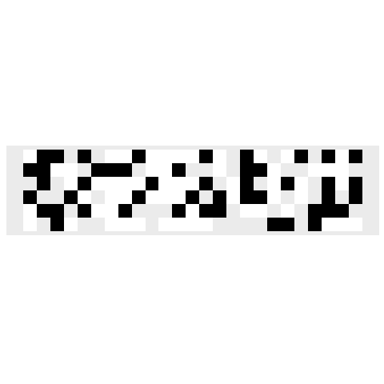

```{r setup, include=FALSE}
library(gganimate)
library(gifski)
library(ggplot2)
library(reshape2)
library(knitr)
library(dplyr)
library(stringr)
library(tidyverse)
library(readr)
library(collections)
options(scipen = 999)
```

```{r}
input<-read_lines("../../AoCData/AOC2019/Day8.txt")

```
## Part 1
Ignore the actual rows, just splitting this into layers of 150:

```{r}
layerframe<-as.data.frame(matrix(ncol=3,nrow=0))
i<-1
fewest0s<-Inf
### split into groups of 150
while(i*150<=nchar(input)){
  lyr<-str_sub(input,i*150-149,i*150)
  zeros<-str_count(lyr,"0")
  ones<-str_count(lyr,"1")
  twos<-str_count(lyr,"2")
  ### if the zeros are less than the fewest zeros, find onextwo
  if(zeros<fewest0s){
    fewest0s<-zeros
    onebytwo<-ones*twos
    cat("zeros: ", zeros," ones: ",ones," twos: ",twos,"one x two: ", onebytwo,"\n")}
  layerframe<-rbind(layerframe,c(zeros,ones,twos))
  i<-i+1}


```

## Part 2
First, actually split this into layers - 
```{r}
layers<-t(matrix(unlist(str_split(input,"")),nrow=150,ncol=100))
```
For each column, find the first number that isn't 2.
```{r}
message<-sapply(1:150,function(x){
  a<-layers[,x]
  a<-a[which(a!="2")]
  a<-a[1]
a})
message

```
Then arrange this into rows and columns
```{r}
finalmessage<-matrix(nrow=0,ncol=25)
for(i in 1:6){
finalmessage<-rbind(finalmessage,message[(i*25-24):(i*25)])}

```

```{r,eval=FALSE,echo=FALSE}
messagedf<-as.data.frame(matrix(nrow=0,ncol=4))
bslr<-rep("2",150)
for(i in 100:1){
  lay<-matrix(nrow=0,ncol=25)
  for(j in 1:6){
    lay<-rbind(lay,layers[i,][(j*25-24):(j*25)])}
    lm<-melt(lay)
    lm<-cbind(lm,rep(101-i,150))
    messagedf<-rbind(messagedf,lm)}

colnames(messagedf)<-c("Var1","Var2","value","l")
```


```{r,eval=FALSE,echo=FALSE}
messagecolors<-c("0"="#000000","1"="#FFFFFF","2"="#FF0000")
messagealpha<-c("0"=1,"1"=1,"2"=0.001)
#messageframe<-melt(finalmessage)
messagegraph<-ggplot()+
  scale_fill_manual(values=messagecolors)+
  scale_alpha_manual(values=messagealpha)+
  geom_tile(data=messagedf,aes(x=Var2,y=Var1,fill=value,alpha=value))+
  theme(axis.text.x = element_blank(),
        axis.ticks.x = element_blank(),
        axis.text.y = element_blank(),
        axis.ticks.y = element_blank(),
        axis.title.y = element_blank(),
        axis.title.x = element_blank(),
        panel.grid.major = element_blank(),
        panel.grid.minor = element_blank(),
        legend.position="none")+
  scale_y_reverse()+
  coord_fixed()
messagegraph

messanim<-messagegraph+
  transition_states(l,wrap=FALSE)+
  shadow_mark()
messanim

day8anim<-animate(messanim,renderer = gifski_renderer(),end_pause=25)
day8anim
anim_save("Day8.gif",day8anim)

```



